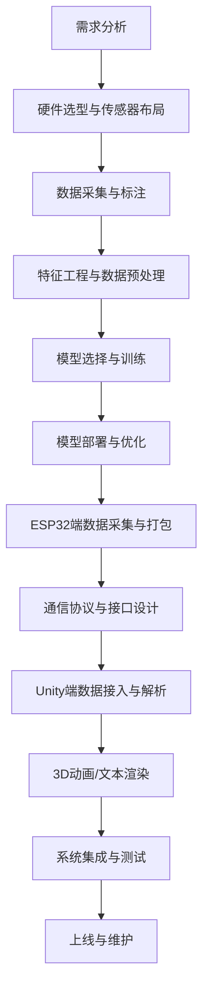
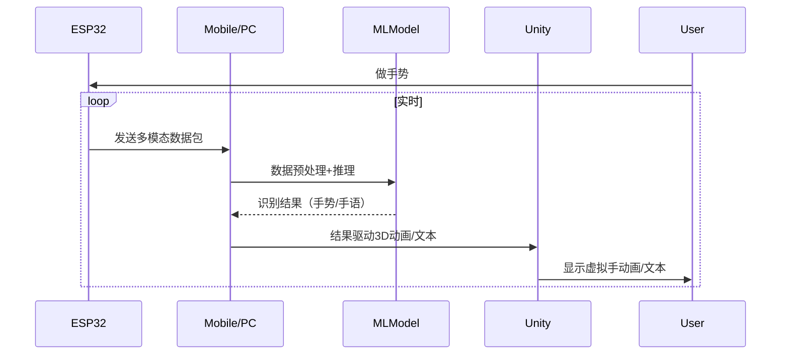

你的需求非常清晰：  
- 用 ESP32 采集 MPU6050（IMU）+ Flex 弯曲传感器的多模态时序数据  
- 通过合适接口/通信方式传输到移动端或PC端的 Unity  
- 用机器学习/深度学习模型进行手势/手语识别  
- 实现 3D 虚拟手动画或文本翻译

下面为你梳理一套完整的开发流程、特征提取与模型建议、接口设计、通信方式，以及整体实现建议。

---

## 1. 开发流程（建议）



---

## 2. 特征提取与模型选择

### 2.1 原始数据
- **MPU6050**：加速度（ax, ay, az）、角速度（gx, gy, gz）、可选欧拉角/四元数
- **Flex**：每根手指的弯曲电阻/角度

### 2.2 特征工程
- **时序特征**：滑动窗口内的均值、方差、最大/最小、变化率、傅里叶/小波变换特征
- **多模态融合**：IMU+Flex数据拼接，或用多分支网络分别提取后融合
- **可选**：手部姿态估计（如通过卡尔曼滤波/互补滤波融合IMU）

### 2.3 模型建议
- **传统ML**：SVM、Random Forest、KNN（适合小样本、低延迟场景）
- **深度学习**：  
  - **RNN/LSTM/GRU**：时序建模，适合手势动态识别
  - **1D/2D CNN**：可处理时序信号或时序-通道拼接
  - **Transformer/TCN**：更强时序建模能力
  - **多模态融合网络**：如多分支LSTM+融合层
- **端侧部署**：可用 TensorFlow Lite、ONNX Runtime、MicroML 等

---

## 3. 通信接口与协议设计

### 3.1 ESP32端
- **数据打包**：建议用二进制或JSON，包含时间戳、各通道数据
- **通信方式**：
  - **WiFi/MQTT**：适合有网络环境，易于云端/多端同步
  - **BLE（蓝牙低功耗）**：适合直连移动端，低延迟
  - **UDP/TCP Socket**：适合局域网内PC端直连，低延迟高吞吐

### 3.2 数据包示例
```json
{
  "ts": 1680000000,
  "flex": [val0, val1, val2, val3, val4],
  "imu": [ax, ay, az, gx, gy, gz]
}
```

### 3.3 Unity端接口
- **BLE插件**：如 [Bluetooth LE for Unity](https://assetstore.unity.com/packages/tools/network/bluetooth-le-for-ios-tvos-and-android-26661)
- **MQTT客户端**：如 [M2Mqtt](https://github.com/eclipse/paho.mqtt.m2mqtt)
- **Socket通信**：Unity自带Socket库或第三方插件

---

## 4. 端到端数据流与推理

1. **ESP32采集**：定时采集IMU+Flex数据，打包发送
2. **移动端/PC端接收**：实时接收数据流
3. **推理方式**：
   - **本地推理**：模型部署在移动端/PC端，Unity直接调用推理库（如TFLite/ONNX）
   - **云端推理**：数据上传云端，云端推理后返回结果（适合高算力/大模型）
4. **Unity渲染**：根据推理结果驱动3D手部骨骼动画或显示文本

---

## 5. 3D动画/文本渲染

- **手势识别结果** → 映射到 Unity 3D 手部骨骼动画（可参考 opengloves-ui-0.4.2 的骨骼映射）
- **手语翻译结果** → 显示为文本或语音

---

## 6. 关键技术选型建议

| 环节         | 推荐技术/工具                         |
|--------------|--------------------------------------|
| 采集         | ESP32/STM32 + MPU6050 + Flex         |
| 通信         | BLE/MQTT/UDP                         |
| 数据处理     | Python/Numpy/Pandas/Scikit-learn     |
| 深度学习     | PyTorch/TensorFlow/Keras             |
| 端侧推理     | TensorFlow Lite/ONNX Runtime         |
| Unity接入    | BLE/MQTT/Socket插件                  |
| 3D动画       | Unity Animator/骨骼映射              |

---

## 7. 典型用例时序图



---

## 8. 总结

- **数据采集**：多模态（IMU+Flex），高频率、低延迟
- **特征提取/模型**：时序特征+深度学习（LSTM/CNN/Transformer等）
- **通信接口**：BLE/MQTT/UDP，数据包结构清晰
- **推理部署**：本地优先，云端可选
- **Unity渲染**：骨骼动画/文本，实时交互

---

如需具体某一环节（如特征工程代码、模型结构、ESP32通信代码、Unity端接入示例等）详细方案或代码，欢迎随时提问！