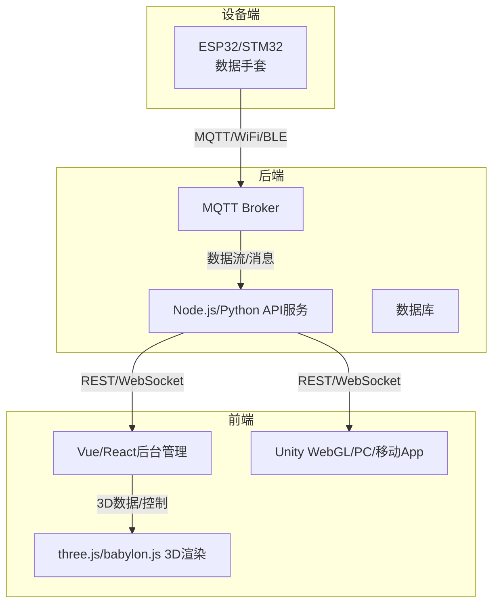

如果我将使用机器学习和深度学习为手势手语翻译vr数据手套训练mpu6050 -flex弯曲传感器的时序多模态模型，方便实时数据通过esp32下的传感器采集并传输给移动端或PC端的unity，我制订开发流程，选择合适特征提取方法的模型，设计合适的接口和通信方式，最终实现手势手语翻译成3d虚拟手动画或文本

你的需求总结如下：  
- 项目需**跨平台**（多端适配：PC、移动、Web等）  
- 数据手套需有**跨平台Web后台管理能力**（设备管理、数据可视化、用户管理等）  
- 需有**3D渲染能力**（手部动画、手势可视化等）  
- 需选择合适的**前端/后端开发技术框架**  
- 3D渲染部分，需权衡**WebGL（如three.js、babylon.js）**和**Unity**的优劣

---

## 1. 跨平台能力方案

### 1.1 Web后台管理
- **Web后台**天然跨平台（PC、Mac、移动端浏览器均可访问）
- 推荐采用**前后端分离**架构

### 1.2 3D渲染
- **Web端3D渲染**：WebGL（three.js、babylon.js等），无需安装插件，浏览器即用
- **Unity**：可导出为WebGL、PC、移动端App，但WebGL导出兼容性和性能略逊于原生WebGL库

---

## 2. 技术选型建议

### 2.1 前端

| 场景         | 推荐技术         | 说明 |
|--------------|------------------|------|
| Web后台管理  | Vue3 + Element Plus/Ant Design Vue | 生态成熟，组件丰富，易于开发管理后台 |
|              | React + Ant Design | 现代化、社区活跃，适合大型后台 |
| 3D渲染       | three.js         | 轻量、易用、WebGL生态最强，适合手部动画、模型渲染 |
|              | babylon.js       | 更强的物理/动画支持，适合复杂3D场景 |
|              | Unity WebGL      | 适合已有Unity内容、复杂交互、跨平台App，但WebGL导出体积大、兼容性略差 |

### 2.2 后端

| 场景         | 推荐技术         | 说明 |
|--------------|------------------|------|
| API服务      | Node.js (Express/Koa/NestJS) | JS全栈，易与前端集成，适合实时/物联网场景 |
|              | Python (FastAPI/Django) | 适合AI/数据分析/快速开发 |
|              | Java (Spring Boot) | 适合大型企业级项目 |
| 实时通信     | MQTT/MQTT Broker（如EMQX、Mosquitto） | 设备数据上报/下发 |
|              | WebSocket         | 前端与后台/Unity实时通信 |

### 2.3 数据可视化
- echarts、antv、d3.js（与Vue/React结合）

---

## 3. WebGL vs Unity 对比

| 维度         | WebGL (three.js/babylon.js) | Unity (WebGL/PC/移动) |
|--------------|-----------------------------|----------------------|
| 跨平台       | 浏览器即用，兼容性好         | WebGL导出兼容性一般，PC/移动需打包App |
| 性能         | 轻量，适合数据可视化、一般3D动画 | 复杂场景/高交互性更强 |
| 开发效率     | 前端工程师易上手             | 需Unity开发经验 |
| 生态         | 前端集成好，易与后台/可视化结合 | 3D内容丰富，动画/物理/交互强大 |
| 体积         | 小，加载快                   | WebGL包大，加载慢 |
| 维护         | 前端一体化，易维护           | 需专人维护Unity内容 |

**结论：**
- **Web后台管理+3D可视化**：推荐**Vue/React + three.js/babylon.js**，前后端分离，易于维护，跨平台最佳。
- **如已有大量Unity内容/需高复杂度3D交互**：可用Unity，但WebGL导出需重点测试兼容性和性能。

---

## 4. 推荐技术栈组合

### 方案一：全Web跨平台（推荐）

- **前端后台管理**：Vue3 + Element Plus（或 React + Ant Design）
- **3D渲染**：three.js（或 babylon.js）集成于后台管理或独立页面
- **后端**：Node.js (NestJS/Express) 或 Python (FastAPI)
- **实时通信**：MQTT（设备）+ WebSocket（前端与后台/3D页面）
- **数据可视化**：echarts/antv

### 方案二：Unity为主

- **后台管理**：Vue/React + Element/Ant Design
- **3D渲染**：Unity（PC/移动App，或WebGL导出嵌入Web后台）
- **后端**：同上
- **通信**：MQTT/WebSocket/REST API

---

## 5. 架构示意图

---

## 6. 总结建议

- **Web后台管理+3D渲染**，优先选用**Vue/React + three.js/babylon.js**，跨平台最佳，维护成本低。
- **Unity**适合已有内容或高复杂度3D交互，WebGL导出需重点测试。
- 后端推荐Node.js（物联网生态好）或Python（AI/数据分析强）。
- 实时通信用MQTT（设备）+ WebSocket（前端/3D）。

如需具体技术选型对比、项目脚手架、代码示例或架构细化，欢迎随时提问！